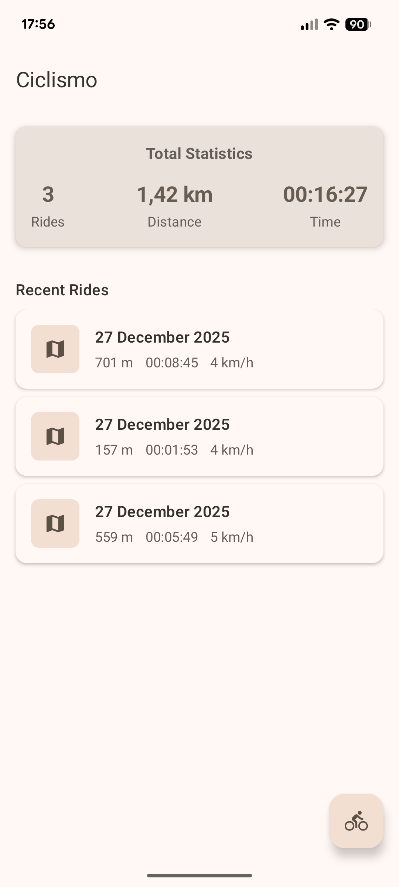
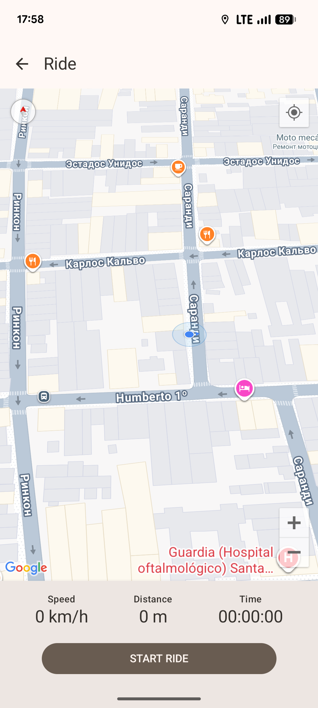
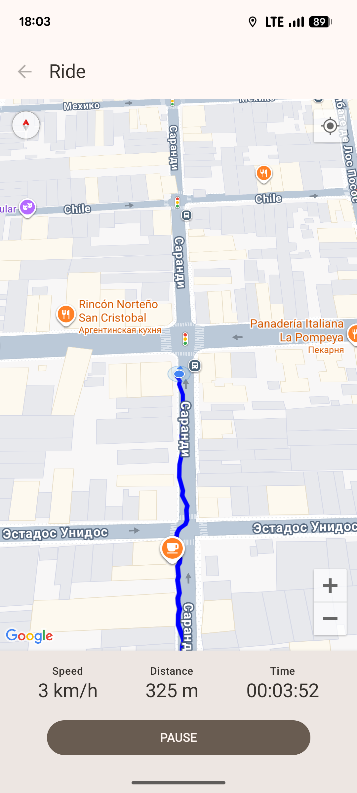
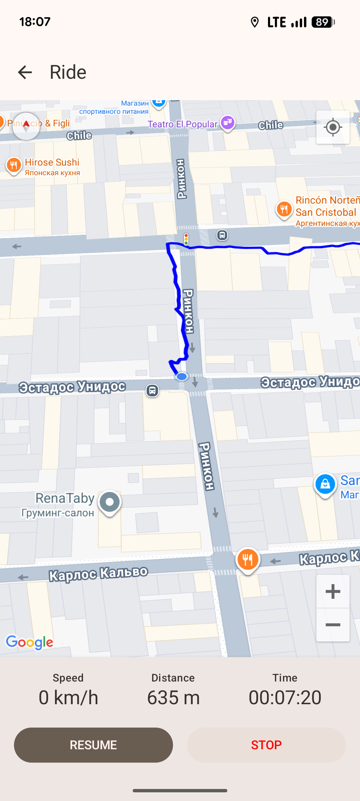
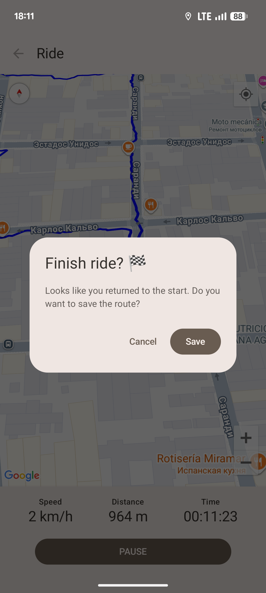
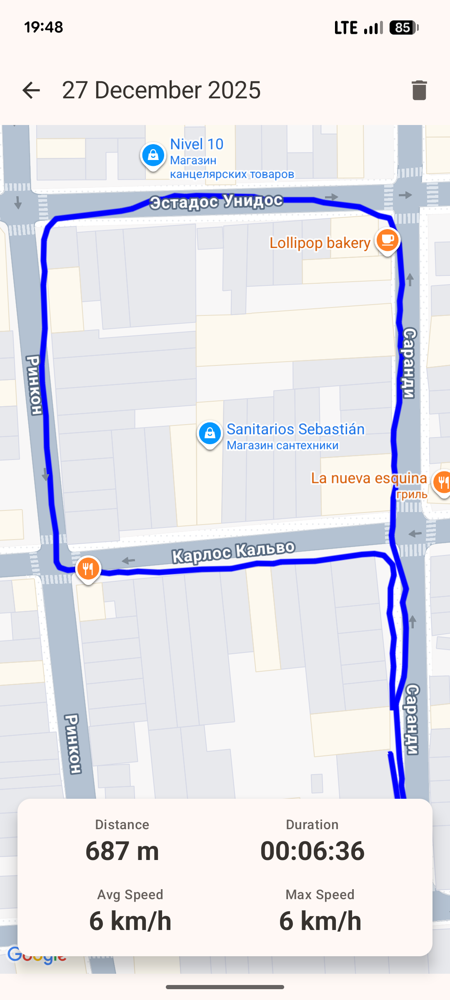

# Ciclismo - Your Minimalist Ride Tracking Companion

Ciclismo is a lightweight, modern Android application designed for cyclists and walkers who want a simple, no-fuss way to track their rides and activities. With a clean interface and powerful features running in the background, Ciclismo focuses on the core experience of tracking your journey.

## Features

Ciclismo provides a seamless and intelligent tracking experience with several key features:

- **Real-Time GPS Tracking**: Records your route with precision, drawing your path on the map as you move.
- **Live Ride Statistics**: Displays essential stats during your ride, including current speed, distance traveled, and total duration.
- **Intelligent Auto-Pause & Resume**: The app automatically pauses the timer and tracking when you stop moving and seamlessly resumes when you start again. No manual intervention is needed!
- **Automatic Finish Detection**: Ciclismo cleverly detects when you've returned to your starting point and prompts you to save your ride, making it easy to end your session.
- **Ride History & Details**: All completed rides are saved locally. You can browse your history and view detailed summaries of each ride, including the route map and performance statistics.

## App Showcase

  
  
  

  
  
  

1.  **Home Screen**: View total statistics and a list of your past rides.
2.  **Tracking Screen**: Get ready to start your journey.
3.  **Ride in Progress**: See your path and live stats.
4.  **Auto-Paused**: The app automatically pauses when you take a break.
5.  **Finish & Save**: Ciclismo prompts you to save when you return to your starting point.
6.  **Ride Details**: Review your completed route and detailed performance metrics.

## Technical Stack & Architecture

This project is a demonstration of modern Android development practices, showcasing a clean, scalable, and maintainable architecture.

- **Architecture**: Follows the **MVVM (Model-View-ViewModel)** pattern along with Google's recommended **Guide to App Architecture**. The architecture is layered into UI, Domain, and Data layers.
  - **UI Layer**: Built entirely with **Jetpack Compose** for a declarative and modern UI. It is stateless, observing state changes from the ViewModel.
  - **Domain Layer**: Contains the core business logic, models, and repository interfaces. This layer is independent of the UI and Data layers.
  - **Data Layer**: Manages the application's data, providing a single source of truth. It includes the repository implementation and data sources (Room database).

- **Tech Stack**:
  - **Kotlin**: The official language for Android development.
  - **Jetpack Compose**: The modern toolkit for building native Android UI.
  - **Coroutines & Flow**: Used extensively for asynchronous operations and reactive state management.
  - **Hilt**: For dependency injection, making the codebase modular and testable.
  - **Room**: For local database storage, providing a persistent history of rides.
  - **Google Maps Compose Library**: For displaying interactive maps and drawing ride routes.
  - **Lifecycle-Aware Components**: The tracking logic is encapsulated in a **Foreground Service** that is also a `LifecycleService`, ensuring it is managed correctly by the Android system.
  - **Gradle Version Catalog (TOML)**: For centralized and type-safe dependency management.
